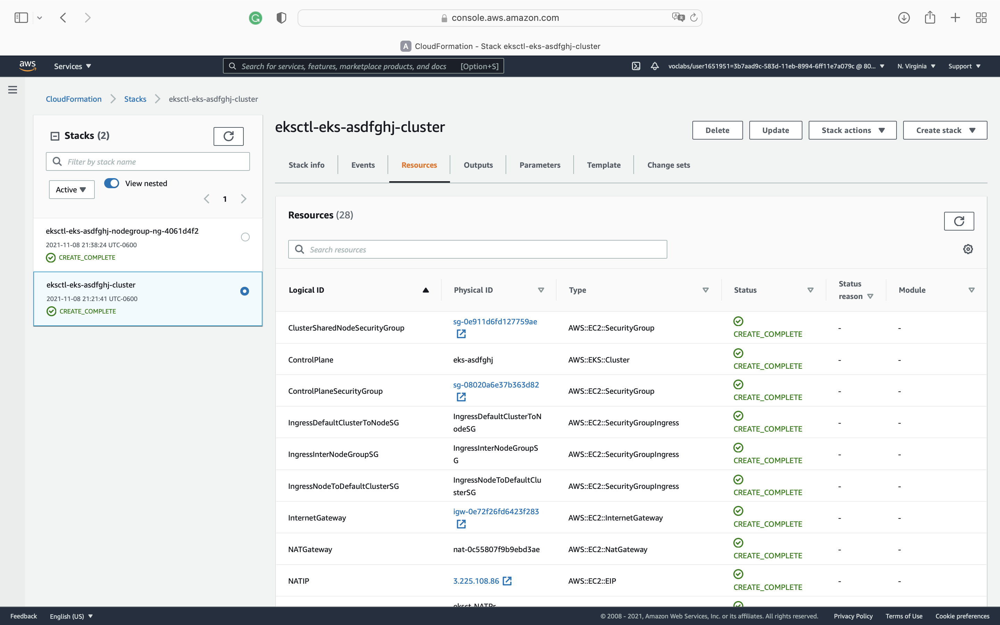
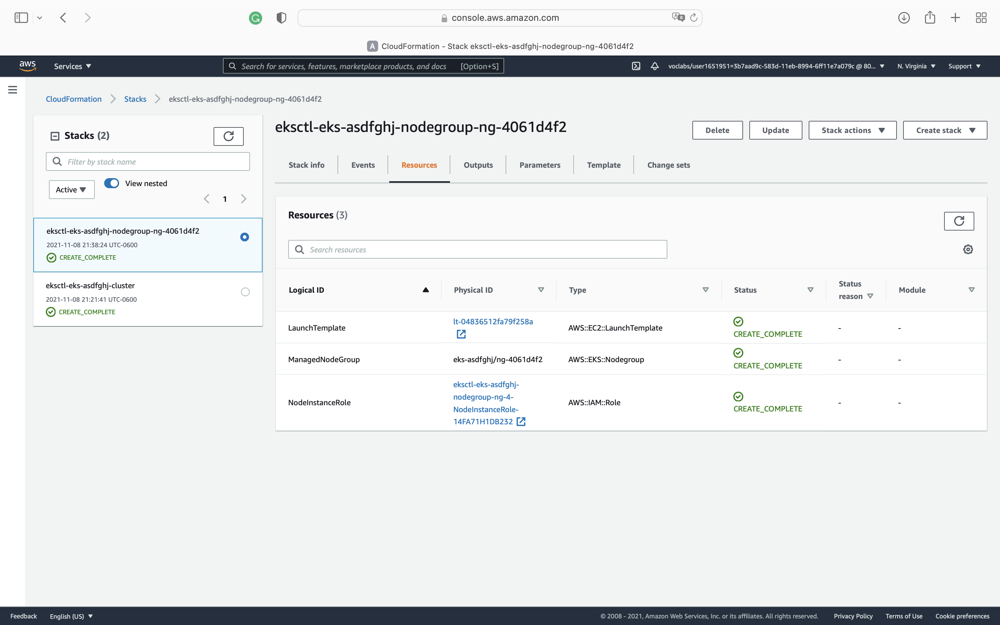
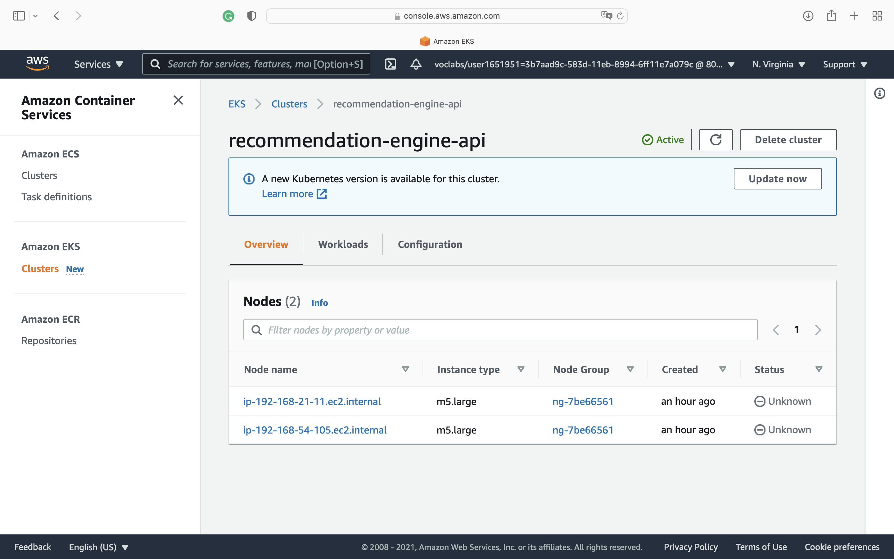
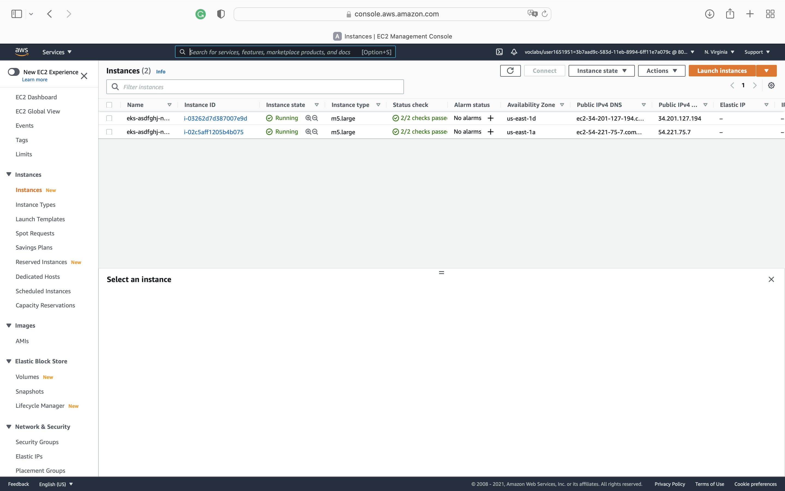
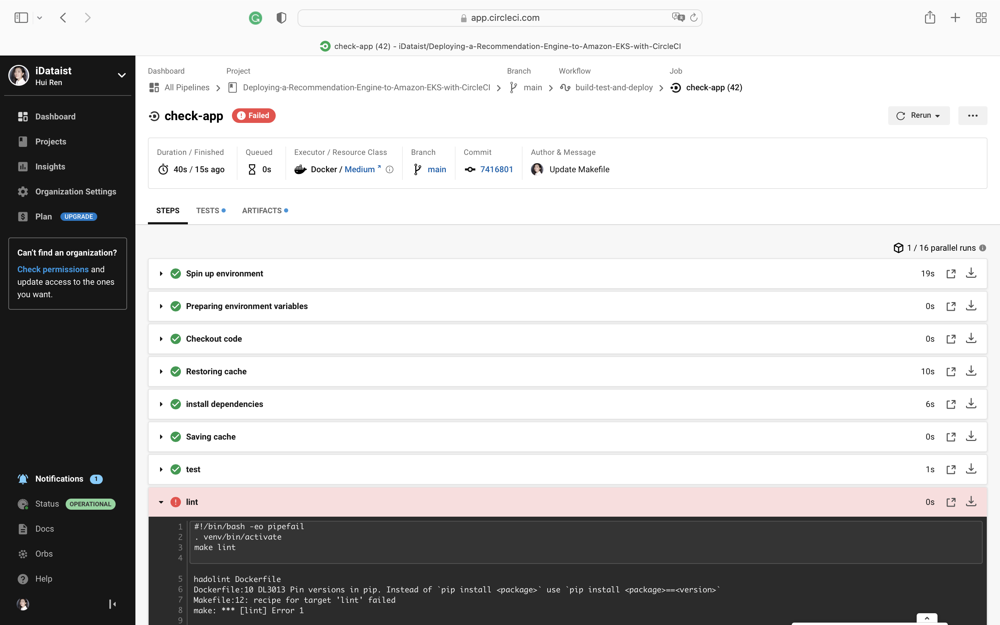
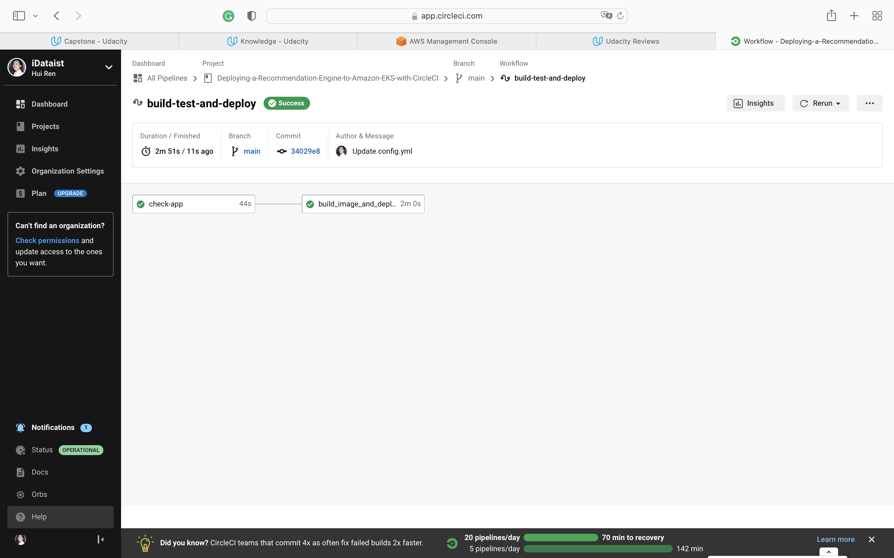

# Deploying a Recommendation Engine to Amazon EKS with CircleCI

## Project Overview
In this project, I used CircleCI to develop a CI/CD pipeline with rolling deployment and applied the following skills:

* Using CircleCI to implement Continuous Integration and Continuous Deployment
* Building CircleCI pipelines
* Building Docker containers in the pipelines
* Working with eksctl and kubectl to build and deploy Kubernetes clusters

## Project Steps

- Using Circle CI, and implementing rolling deployment
    * I set up a circle CI account and connected the git repository
    * I set up the environment to deploy code
    

- Building Kubernetes cluster
    I built the Kubernetes cluster by running `eksctl create cluster --name eks-asdfghj`, which used CloudFormation to deploy the Kubernetes cluster.
    
    
    
    

- Building and testing the pipeline
    I built the CI/CD pipeline with CircleCI.
    
    
    

