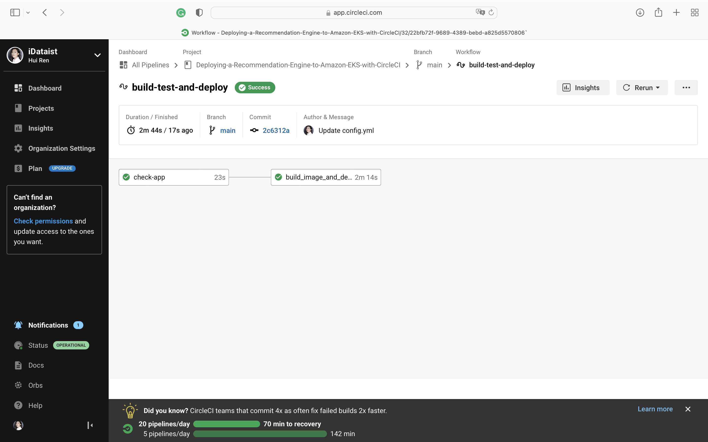

# Cloud DevOps Engineer Capstone Project

## Step 1: Propose and Scope the Project
In this project, I used CircleCI to develop a CI/CD pipeline with rolling deployment and applied the following skills:

* Working with AWS
* Using CircleCI to implement Continuous Integration and Continuous Deployment
* Building CircleCI pipelines
* Building Docker containers in the pipelines
* Working with eksctl and kubectl to build and deploy Kubernetes clusters

## Step 2: Use Circle CI, and implement rolling deployment
* I set up a circle CI account and connected the git repository
* I set up the environment to deploy code

## Step 3: Build Kubernetes cluster
I built the Kubernetes cluster by running `eksctl create cluster --name eks-asdfghj`, which used CloudFormation to deploy the Kubernetes cluster.

## Step 4: Build the pipeline
I built the CI/CD pipeline with CircleCI.

## Step 5: Test your pipeline

